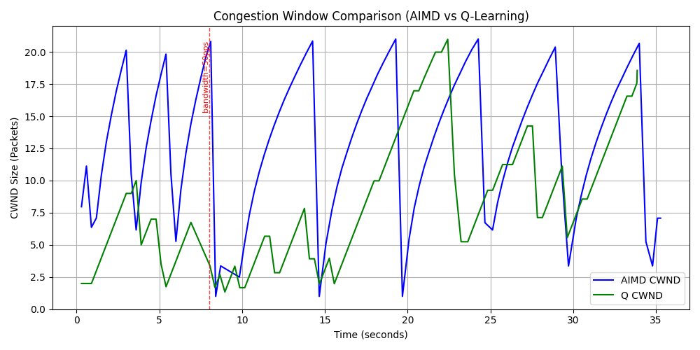
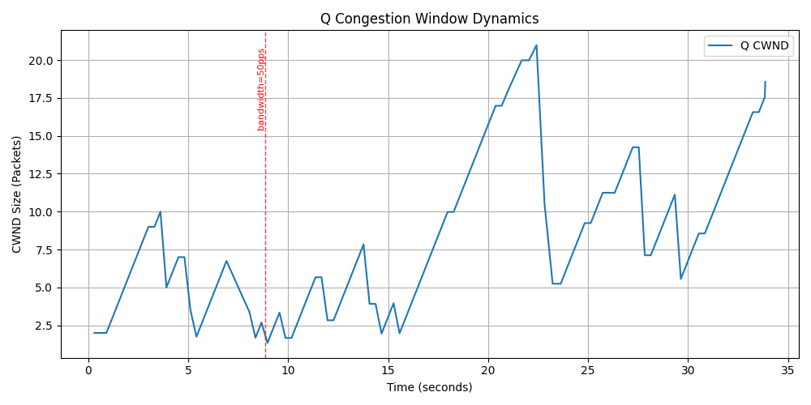
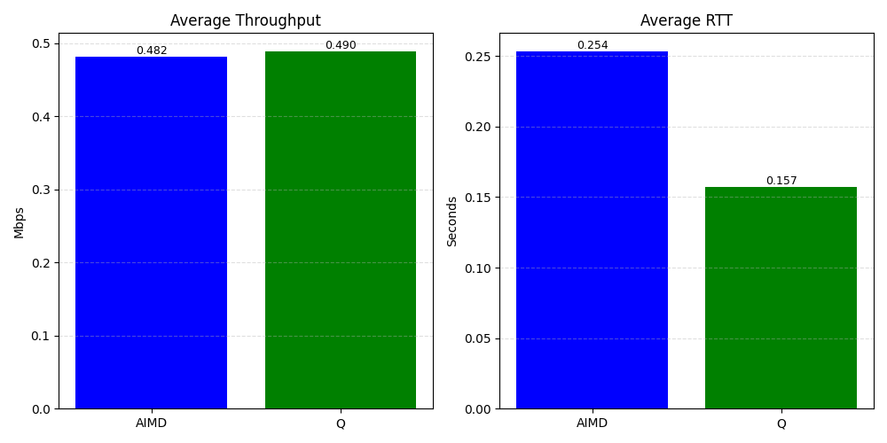

# 设计与测试报告

## 协议与可靠传输设计

应用层 UDP 数据报固定为 1036 字节：

```text
+----------------------+------------------+----------------------+
| Sequence Number 4B   | Timestamp 8B     | Payload 1024B        |
+----------------------+------------------+----------------------+
```

`protocol.py` 使用网络字节序 `!Id1024s` 编解码。发送端将每个已发送但未确认的包放入未确认队列，记录原始时间戳、最近发送时间和是否重传。接收端返回 4 字节 ACK，ACK 语义为“最后一个连续收到的数据包序号”。

接收端维护 `expected_seq` 和乱序缓冲：

- 收到 `expected_seq` 时推进累计确认，并连续消费缓冲区中的后续包。
- 收到更大的序号时放入乱序缓冲，并重复 ACK `expected_seq - 1`。
- 新发送端从序号 1 开始连接时，接收端重置会话状态，便于 AIMD 与 Q-Learning 连续对照。

发送端同时实现两类重传：

- RTO 重传：超过动态 RTO 未收到 ACK 时重传，RTO 由 SRTT 的 1.5 倍估计，且不小于 100ms。
- 快速重传：连续 3 个重复累计 ACK 出现时，立即重传 `ack + 1`，无需等待 RTO。

重传包不参与 SRTT 更新，避免重传 ACK 混淆 RTT 估计。

## 虚拟瓶颈链路

`VirtualLink` 封装在发送端 `sendto()` 外层，默认配置为：

- 带宽：100 packets/s，即约每 10ms 漏出一个包。
- 队列容量：20 个包。
- 队列满时直接丢弃新包，统计为链路层拥塞丢包。

扩展功能包括：

- 动态突变：运行中调用 `set_bandwidth_pps()`，默认第 8 秒降为 50 packets/s。
- 故障注入：`--drop-once N` 让第 N 个包首次发送时被丢弃一次，用于稳定演示快速重传与乱序缓存。

## 拥塞控制

AIMD 基线按 TCP Reno 风格实现：

```text
初始：cwnd = 1
收到新 ACK：cwnd += 1 / cwnd
RTO 或快速重传：cwnd = max(1, cwnd / 2)
```

Q-Learning 控制器使用 6 个离散状态和 3 个动作：

- 状态：RTT 趋势（降低/平稳/升高）x 丢包事件（未发生/发生）。
- 动作：0 保持，1 执行 `cwnd + 1`，2 执行 `cwnd / 2`。
- 策略：epsilon-greedy 探索，Bellman 公式在线更新 Q-Table。

奖励函数：

```text
R = 40.0 * throughput_mbps - 5.0 * avg_rtt - 2.5 * loss_count
```

其中 `loss_count` 包括虚拟链路丢包、RTO 和快速重传信号。
Q-Table 采用轻量先验初始化：无丢包状态略倾向增窗，丢包状态略倾向退避，随后仍由 epsilon-greedy 与 Bellman 更新在线修正。

## 测试与可视化

已验证的场景：

- 协议封包长度为 1036 字节，payload 可正确补零和还原。
- `test_link.py` 中 30 个瞬时包在 20 队列容量下触发 10 次溢出丢包。
- 小规模本地闭环中，AIMD 和 Q-Learning 均能完成可靠传输。
- `--drop-once 15` 可触发 AIMD 的 3 重复 ACK 快速重传。
- `--dynamic` 可在运行中降低虚拟链路带宽，并在 CWND 图上标出突变点。

完整实验命令：

```bash
python receiver.py --port 8888
python sender.py --controller both --packets 2000 --dynamic --drop-once 80 --output-dir .
```

实验输出以 `summary.json` 和四张图为准：

- `cwnd_compare.png` 对比 AIMD 锯齿状窗口和 Q-Learning 的在线调整过程。
- `throughput_delay_bar.png` 对比两种算法的平均 Mbps 和平均 RTT。
- `aimd_result.png`、`q_learning_result.png` 分别展示单算法 CWND 曲线。



### Q-Learning 收敛曲线

`q_learning_result.png` 为 Q-Learning 的在线训练与收敛曲线。该曲线横轴为运行时间，纵轴为 `cwnd`。发送端每个控制周期根据“RTT 趋势 x 丢包事件”得到当前状态，使用 epsilon-greedy 选择动作，并由 Bellman 公式更新 Q-Table。



本次实验中，Q-Learning 从较小窗口开始探索，在动态带宽突变和一次性丢包注入后仍能继续调整窗口，最终最大 `cwnd` 达到 20.98。相比 AIMD 的周期性锯齿震荡，Q-Learning 的曲线更偏向受奖励函数约束的在线调节：在保持接近 AIMD 最高窗口的同时，减少了队列溢出和重传。

### AIMD 与 AI 算法吞吐量详细对比



本次完整实验结果如下：

| 算法 | 平均吞吐(Mbps) | 平均RTT(s) | 最大CWND | 链路丢包 | RTO超时 | 快速重传 | 总重传 |
| --- | ---: | ---: | ---: | ---: | ---: | ---: | ---: |
| AIMD | 0.482 | 0.254 | 21.00 | 23 | 93 | 19 | 112 |
| Q-Learning | 0.490 | 0.157 | 20.98 | 2 | 16 | 3 | 19 |

从吞吐量看，Q-Learning 平均吞吐为 0.490 Mbps，AIMD 为 0.482 Mbps，AI 控制器约提升 1.5%。吞吐提升幅度不大，但 Q-Learning 同时把平均 RTT 从 0.254s 降到 0.157s，降低约 38.0%。这说明 Q-Learning 没有单纯通过激进增大发送窗口换取吞吐，而是在奖励函数中平衡吞吐、排队延迟和丢包惩罚。

从可靠性和拥塞代价看，AIMD 发生 23 次链路丢包、93 次 RTO、112 次总重传；Q-Learning 只有 2 次链路丢包、16 次 RTO、19 次总重传。AI 控制器在相同网络突变和丢包注入下，以更低的拥塞代价获得略高吞吐和更低延迟。
